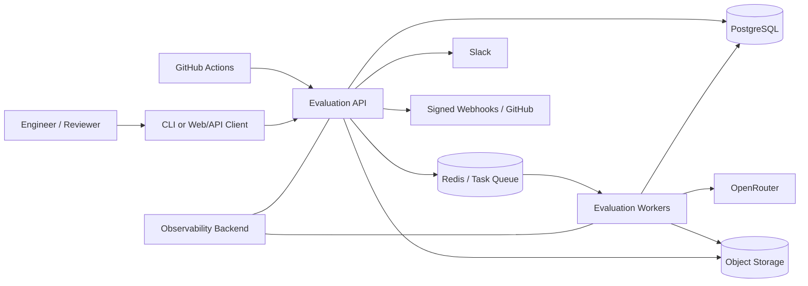
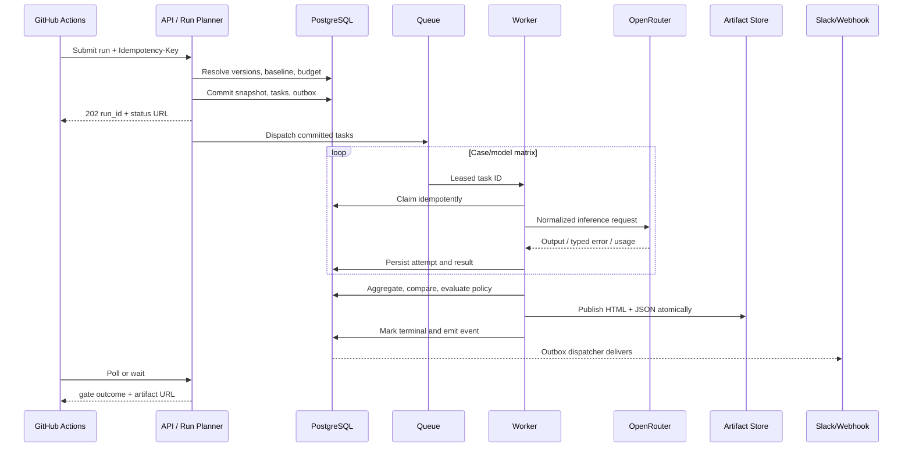

# System Architecture

## 1. Purpose and architecture drivers

This document proposes a production architecture for an auditable LLM evaluation control plane. It optimizes for immutable evidence, deterministic orchestration around nondeterministic providers, safe CI gating, extensibility, and a practical path from one deployment to high-volume distributed execution.

Primary drivers:

- Evaluate many cases across multiple models without tying work to an HTTP request.
- Freeze all mutable inputs before execution.
- Compare candidates only with compatible baseline evidence.
- Preserve partial results and distinguish quality failures from infrastructure failures.
- Add providers, evaluators, reporters, and notifiers behind stable interfaces.
- Control cost, concurrency, privacy, and third-party failure domains.

## 2. Recommended architecture style

Start as a **modular monolith with independently deployable API and worker processes**, backed by PostgreSQL, Redis, and S3-compatible object storage. Keep domain boundaries explicit in packages and contracts rather than introducing networked microservices early.

Why:

- Evaluation orchestration needs transactions and consistent invariants more than independent service scaling initially.
- API and workers can scale separately while sharing one codebase and schema.
- Provider calls dominate runtime, so asynchronous worker concurrency provides scale without service proliferation.
- Stable ports/adapters allow future extraction of execution, reporting, or integrations when operational evidence justifies it.

Recommended initial technology choices, subject to approval: Python 3.12+, FastAPI, Pydantic v2 concepts, SQLAlchemy/Alembic, PostgreSQL, Redis-backed durable task processing, S3-compatible artifacts, Jinja-style templating with strict undefined variables, OpenTelemetry, and containerized processes. Specific libraries must be pinned during implementation planning.

## 3. Context diagram



## 4. Logical components

### 4.1 API/control plane

Responsibilities:

- Authentication, authorization, tenant/project scoping, rate limiting.
- CRUD and publication workflows for prompts, datasets, suites, evaluators, policies, model configs, and integrations.
- Run submission, immutable snapshot resolution, idempotency, validation, cancellation, and query.
- Baseline promotion with optimistic concurrency.
- Artifact access through authorization-aware signed URLs or streaming.
- API schema and event schema versioning.

It does not perform provider calls or long-running scoring in request handlers.

### 4.2 Run planner

A domain service invoked at submission:

1. Resolves suite, prompt, dataset, evaluator, policy, model, and baseline selectors.
2. Validates project ownership and compatibility.
3. Calculates the matrix of case × candidate model × sample.
4. Estimates calls/tokens/cost where possible and enforces budget.
5. Persists an immutable canonical snapshot and content hash transactionally.
6. Creates execution work records and an outbox event.

No work is queued until the database transaction commits. An outbox dispatcher publishes tasks, preventing “database committed but queue message lost” races.

### 4.3 Orchestrator and queue

The orchestrator coordinates task states; the queue transports work but is not the source of truth. PostgreSQL owns run/task state. A task contains opaque IDs, not prompt content or secrets.

Required properties:

- At-least-once delivery with idempotent claiming.
- Visibility timeout/lease heartbeat for long calls.
- Bounded retry with exponential backoff and jitter.
- Per-project/provider/model concurrency and rate-limit buckets.
- Priority classes for CI, interactive, and scheduled runs.
- Dead-letter/reconciliation workflow.
- Cooperative cancellation.

Initial task types: validate snapshot, execute candidate case, execute baseline if materialization is requested, evaluate deterministic metrics, execute judge evaluator, aggregate, compare, render report, dispatch notification, and reconcile run.

### 4.4 Prompt renderer

- Uses the prompt snapshot and case input only.
- Strictly validates variables and size limits.
- Produces canonical chat/messages or text form.
- Records a rendered-content hash and optionally encrypted/rendered evidence based on retention policy.
- Has no network access and cannot resolve arbitrary expressions, files, or environment variables.

### 4.5 Provider gateway

The gateway converts a provider-neutral inference request into an adapter call and normalizes the response. OpenRouter is adapter one.

Provider adapter conceptual interface:

| Operation | Contract |
|---|---|
| `validate_configuration` | Verify model/settings shape without exposing credentials; optional low-cost connectivity test is explicit |
| `resolve_model` | Return provider model identity/revision metadata when available |
| `estimate` | Best-effort token and cost estimate with confidence/source |
| `generate` | Execute one normalized inference request and return normalized response or typed provider error |
| `cancel` | Optional; return unsupported rather than pretending cancellation succeeded |
| `health_capability` | Describe local configuration/capability, not third-party availability for liveness |

Normalized provider errors include authentication, authorization, invalid request, unsupported model, rate limited, timeout, transient upstream, content policy, budget exceeded, and unknown. Retryability is explicit.

The gateway applies timeout, circuit breaking, provider rate limiting, trace correlation, usage capture, and redacted telemetry. API keys are resolved at call time from a secret provider and never inserted into the run snapshot.

### 4.6 Evaluator engine

Evaluators consume immutable case context and candidate output and produce normalized evaluation results. They cannot directly mutate run state.

Evaluator categories:

- Deterministic: exact/normalized match, substring, regex, JSON/schema, rule assertions.
- Operational: latency, token, cost, response status.
- Model-based: rubric judge with pinned model/prompt/rubric and optional structured output.
- Future plugin types: semantic, custom sandboxed code, external service, human review.

Evaluator adapter conceptual interface:

| Operation | Contract |
|---|---|
| `validate_definition` | Validate configuration and declared input/output requirements |
| `semantic_identity` | Stable hash/version used to determine comparison compatibility |
| `evaluate` | Return status, score/label, explanation, structured evidence, usage, and error |
| `aggregate` | Optional evaluator-specific aggregation; default aggregation is platform-owned |

Model judges must defend against prompt injection from candidate output by delimiting it as untrusted data, using constrained structured responses, excluding tools, and applying output validation. Judge evidence records its own provider attempts and cost.

### 4.7 Aggregation and comparison engine

Aggregation computes immutable metric observations by run, candidate, evaluator, and dataset slice. It must be a pure calculation over persisted evidence and versioned aggregation semantics.

Comparison:

- Pairs stable case keys.
- Requires evaluator semantic compatibility.
- Applies metric direction and handles zero/missing denominators explicitly.
- Produces case classifications, aggregate deltas, coverage details, and warnings.
- Does not decide deployment outcome; it creates evidence consumed by the policy engine.

### 4.8 Policy engine

The policy engine is deterministic and side-effect free. Inputs are policy snapshot, run summary, comparison evidence, and compatibility/coverage status. Output includes gate outcome and ordered rule decisions.

Rule result fields: rule ID, severity, status (`passed`, `violated`, `not_applicable`, `insufficient_evidence`, `errored`), observed value, threshold, unit, scope/slice, affected case keys, and explanation.

Policy versions must define behavior for missing baseline, baseline errors, missing candidate cases, metric evaluator errors, and new candidate-only cases. No implicit defaults may convert absent evidence to pass.

### 4.9 Report service

- Reads a completed immutable result snapshot.
- Generates schema-versioned JSON and self-contained HTML.
- Escapes all prompt/output/evaluator content and applies restrictive CSP.
- Uses stable sorting and formatting to make reports reproducible.
- Writes artifacts atomically, stores hash/size/content type, then marks publication complete.
- Supports regeneration with a newer renderer version without changing gate evidence; every artifact records renderer version.

### 4.10 Integration dispatcher

Consumes transactional outbox events and delivers Slack/webhook/GitHub notifications at least once. Delivery attempts are persisted with deduplication IDs. Notification failure cannot change a completed gate result, but it is observable and retryable.

### 4.11 Scheduler and reconciler

A periodic process:

- Reclaims expired task leases.
- Detects runs with no runnable tasks and finalizes/reports them.
- Reconciles usage/cost and concurrency reservations.
- Expires stale queued runs.
- Applies artifact/data retention.
- Emits alerts for stuck states and poison tasks.

## 5. End-to-end data flow



## 6. State models

### 6.1 Run execution state

```text
created -> validating -> queued -> running -> evaluating -> comparing -> reporting -> completed
                    \-> failed       \-> failed       \-> failed       \-> failed
queued/running/evaluating/comparing/reporting -> cancelling -> cancelled
created/queued -> expired
```

Rules:

- State transitions use compare-and-set revisions.
- Terminal states never transition back.
- A retry creates new task attempts within the same run; an explicit rerun creates a new run linked to its predecessor.
- `completed` means the pipeline generated valid final evidence, even when gate outcome is `fail`.
- `failed` maps to gate `error`, never `fail`.

### 6.2 Work item state

`pending -> leased -> succeeded | retry_wait | permanently_failed | cancelled | skipped`.

A lease includes owner and expiry. Only the current lease owner can finalize an attempt. A unique logical work key prevents duplicate successful evidence.

### 6.3 Baseline lifecycle

A baseline channel is a mutable, revisioned pointer with immutable history. Promotion requires an eligible completed run, compatible suite/project, expected current revision, actor, and reason. Rollback is a new promotion to an older eligible run, not history deletion.

## 7. API/interface definitions

### 7.1 REST resources

Representative contracts; exact OpenAPI details are an implementation-phase deliverable.

| Method and path | Purpose | Success behavior |
|---|---|---|
| `POST /api/v1/projects` | Create project | `201`, project representation |
| `POST /api/v1/projects/{p}/prompts` | Create prompt identity | `201` |
| `POST /api/v1/prompts/{id}/versions` | Create immutable prompt version | `201`; duplicate content may return existing version by policy |
| `POST /api/v1/projects/{p}/datasets` | Create dataset draft | `201` |
| `PUT /api/v1/datasets/{id}/draft/cases/{key}` | Idempotently upsert draft case | `200` |
| `POST /api/v1/datasets/{id}/validate` | Validate draft | `200` with issues |
| `POST /api/v1/datasets/{id}/publish` | Freeze version | `201` with content hash |
| `POST /api/v1/projects/{p}/model-configurations` | Register model settings | `201`; secret reference write-only |
| `POST /api/v1/projects/{p}/suites` | Create suite draft/version | `201` |
| `POST /api/v1/projects/{p}/runs` | Submit immutable run | `202`; idempotent |
| `GET /api/v1/runs/{id}` | Run status and summary | `200`; no large evidence inline |
| `GET /api/v1/runs/{id}/results` | Cursor-paginated case results | `200` |
| `POST /api/v1/runs/{id}/cancel` | Request cancellation | `202` or idempotent terminal response |
| `GET /api/v1/runs/{id}/comparison` | Comparison and rule decisions | `200` when available; otherwise state-aware conflict |
| `GET /api/v1/runs/{id}/artifacts` | List authorized artifacts | `200` |
| `PUT /api/v1/projects/{p}/baselines/{channel}` | Promote baseline | `200`; requires expected revision and reason |
| `GET /api/v1/projects/{p}/runs` | Filter historical runs | `200`, cursor pagination |
| `POST /api/v1/projects/{p}/integrations/slack/test` | Test redacted notification | `202` |
| `GET /health/live` / `GET /health/ready` | Operational health | Minimal non-secret output |

### 7.2 Run submission concept

Required fields:

- `project_id`, `suite_version_id`.
- Candidate list, each selecting a prompt version and model configuration version with an optional display alias.
- Baseline selector: channel, explicit run, or none, plus missing-baseline behavior.
- Source context: repository, commit SHA, branch/ref, pull request, actor.
- Execution overrides from an allowlisted subset only: priority, approved concurrency reduction, report options.
- Client metadata with size and key restrictions.

Response fields:

- `run_id`, accepted timestamp, execution state, gate outcome, snapshot hash, resolved baseline, estimated work/cost, URLs, and correlation ID.

### 7.3 CI contract

A future CLI or reusable Action should expose:

- Inputs: service URL, project, suite/version, candidate refs, baseline channel, source revision, timeout, token from secret store.
- Outputs: run ID, execution state, gate outcome, report URL, summary JSON path, cost, regression count.
- Process outcomes: success only on gate pass; separate documented nonzero codes for quality fail, system error/timeout, invalid request, and local client error.
- Timeout behavior: client timeout does not cancel server run unless explicitly requested.
- Artifact upload: HTML/JSON can be attached to GitHub Actions while authoritative copies remain server-side.

### 7.4 Webhook event envelope

Conceptual fields: schema version, event ID, event type, occurred time, workspace/project IDs, resource ID, correlation ID, attempt number, and typed data. Supported initial events: run queued, run completed, gate failed, run errored, and baseline promoted. Signature covers timestamp plus exact body; replay window and event-ID deduplication are required.

## 8. Pydantic-style conceptual data models

These are interface models, not source code. Shared rules: UUID/opaque IDs, timezone-aware UTC timestamps, forbidden unknown fields for commands, bounded strings/collections, discriminated unions, canonical serialization for hashes, and separate create/read/internal models so secrets and internal fields cannot leak.

### 8.1 Core value objects

| Model | Key fields | Validation/invariants |
|---|---|---|
| `ResourceRef` | `id`, `version_id`, `content_hash` | Published execution refs require exact version and hash |
| `SourceContext` | `repository`, `commit_sha`, `ref`, `pull_request`, `actor` | SHA format/length bounded; URLs normalized; optional but immutable in snapshot |
| `MetricValue` | `name`, `value`, `unit`, `direction`, `sample_count` | Finite numeric values; unit and direction required |
| `ProblemDetail` | `type`, `title`, `status`, `code`, `detail`, `instance`, `issues` | Stable machine code; no secret values |
| `Page[T]` | `items`, `next_cursor` | Cursor opaque; bounded page size |

### 8.2 Authoring models

| Model | Key fields | Validation/invariants |
|---|---|---|
| `PromptVersionCreate` | prompt ID, template/messages, variable schema, rendering version, changelog | Variables declared exactly; bounded content; canonical hash |
| `GoldenCaseDraft` | stable key, inputs, expected output, assertions, tags, criticality, metadata | Key unique per version; JSON-safe values; metadata limits |
| `DatasetPublishCommand` | dataset ID, expected draft revision, release note, classification | Fails on validation errors or revision conflict |
| `ModelConfigurationCreate` | adapter, model ID, parameters, timeout, retry, routing, secret ref | Adapter-specific discriminated config; secret write-only |
| `EvaluatorVersionCreate` | type, config, metric declarations, rubric/model refs | Type-specific config; stable semantic hash |
| `PolicyVersionCreate` | rules, missing-evidence behavior, compatibility rules | Unique rule IDs; valid metric refs; no contradictory thresholds |
| `SuiteVersionCreate` | dataset ref, evaluators, policy ref, execution defaults | All refs same project; published versions only |

### 8.3 Execution models

| Model | Key fields | Validation/invariants |
|---|---|---|
| `RunCreateCommand` | project, suite, candidates, baseline selector, source context, metadata | At least one candidate; aliases unique; idempotency external header |
| `RunSnapshot` | all resolved refs/configs, case manifest hash, baseline ref, source, planner version | Immutable; canonical hash; contains secret IDs only, never values |
| `InferenceRequest` | messages/input, model config, response contract, trace context | Internal only; token/size bounds; no undeclared fields |
| `ProviderResponse` | output, structured content, finish reason, usage, latency, cost, provider IDs, resolved model | Exactly one success or typed error state |
| `ProviderError` | category, code, retryable, safe message, provider request ID | Raw sensitive body stored only under restricted retention policy |
| `EvaluationResult` | evaluator ref, status, score/label, explanation, evidence, usage, error | Score finite/in declared range; errored has typed error |
| `CaseResult` | case ref, candidate alias, render hash, provider attempt ref, evaluations, status | Unique logical work key; append attempts, one selected result |

### 8.4 Comparison/report models

| Model | Key fields | Validation/invariants |
|---|---|---|
| `MetricComparison` | metric identity, scope, baseline, candidate, absolute/relative delta, class | Relative delta nullable with explicit reason |
| `CaseComparison` | case key, evaluator identity, baseline/candidate refs, classification, diffs | Incomparable reason required when not paired |
| `RuleDecision` | rule ID, severity, status, observed, threshold, affected cases, explanation | Deterministic ordering and bounded evidence list |
| `GateDecision` | outcome, rule decisions, coverage, policy ref, engine version | `pass` impossible with violated blocking rule or insufficient required evidence |
| `RunSummary` | run state, gate, counts, metrics, usage/cost, timestamps, artifact refs | Aggregate reconciles with persisted selected results |
| `ArtifactManifest` | kind, schema/renderer version, URI, hash, size, content type | URI internal/signed separately; hash verified after write |

### 8.5 Serialization and evolution

- API models carry schema version where persisted or emitted externally.
- Additive optional fields are backward compatible; changed semantics require a new schema or evaluator/policy version.
- Enums have an `unknown` handling strategy for clients but servers reject unknown command values.
- Decimal is used conceptually for money; integer counts for tokens; durations use integer milliseconds.
- Large prompts/outputs are referenced rather than duplicated in event and list models.

## 9. Persistence and consistency

PostgreSQL is authoritative for metadata, state, selected evidence, aggregates, policy decisions, audit, outbox, and artifact manifests. Object storage holds large raw payloads and reports. Redis holds queue messages, ephemeral rate-limit state, locks with bounded leases, and caches only.

Consistency boundaries:

- Run snapshot, work manifest, budget reservation, and outbox insertion commit atomically.
- Provider call cannot be transactionally atomic with the database; attempt IDs and idempotent result selection address ambiguity.
- Task finalization and follow-on outbox creation commit atomically.
- Artifact bytes are written to a temporary key, hash-verified, promoted, then manifested in the DB.
- Aggregation can be recomputed from selected immutable results; derived rows record engine version.

See [database.md](database.md) for the relational proposal.

## 10. Security architecture

### Trust boundaries

1. External clients to API.
2. API/worker to database, Redis, object store, and secret manager.
3. Worker to OpenRouter/other providers.
4. Model-generated content to evaluators and reports.
5. Integration dispatcher to Slack/GitHub/webhook consumers.

Controls:

- TLS throughout; workload identity or short-lived credentials where available.
- Project authorization in service layer and database query scoping; optional PostgreSQL RLS as defense in depth later.
- Dedicated worker egress allowlist; report renderer has no outbound network access.
- Secret manager interface with environment-based local adapter and managed production adapter.
- Prompt/output treated as untrusted; no dynamic code evaluation.
- Artifact encryption, signed short-lived downloads, path/key randomization, and authorization before URL issuance.
- Per-project budgets and provider/model allowlists evaluated before queueing and again before calls.
- Audit all privileged reads of restricted raw payloads.
- Dependency/image scanning, SBOM, signed images, non-root runtime, read-only filesystem where practical.

Threat-model focus: IDOR/cross-tenant access, webhook forgery/replay, malicious output in reports, prompt injection into judge, SSRF via provider/custom endpoints, secret leakage, budget denial-of-wallet, queue poisoning, and baseline unauthorized promotion.

## 11. Reliability and failure handling

| Failure | Expected behavior |
|---|---|
| OpenRouter 429/transient 5xx | Retry within policy and deadline; honor retry hints; release/reacquire rate token |
| Authentication/invalid model | Permanent failure; stop equivalent work where appropriate; gate error |
| Worker crash after provider response | Reclaimed lease may repeat call; persist attempt IDs and select one valid result; account duplicate cost |
| Queue unavailable after run commit | Outbox remains undispatched; dispatcher retries; run visible as queued/stalled |
| Database unavailable | Do not call provider without a durable claim; retry safely |
| Object store unavailable | Preserve gate evidence; retry reporting; run remains reporting until deadline then error with recoverable artifact task |
| Slack/GitHub unavailable | Gate remains final; delivery retries/dead-letters and alerts |
| Baseline deleted/changed | Immutable target cannot be deleted while referenced; channel revision resolved in snapshot |
| Cancellation during provider call | Mark cancellation requested; ignore late output for gate selection but retain attempt audit per policy |
| Partial matrix failure | Aggregate coverage/error metrics; policy determines error; never silently drop cases |

## 12. Observability and SLOs

### Signals

- Metrics: API latency/error, queue age/depth, active leases, task retries, run duration by phase, provider latency/error/rate limit, tokens/cost, evaluator errors, gate outcomes, report duration, notification delivery, stuck runs.
- Traces: API submission through outbox, task, provider attempt, evaluation, report, and notification; payloads excluded.
- Logs: structured identifiers and safe categorical data; no prompts, outputs, keys, authorization headers, or raw provider bodies by default.
- Audit: separate append-only domain record, not operational logs.

Suggested initial SLOs:

- 99.5% control-plane availability monthly.
- 99% of accepted runs begin execution within five minutes under declared capacity.
- 99.9% of valid completed comparisons yield downloadable JSON/HTML within two minutes.
- 99.9% notification event persistence; third-party delivery tracked separately.

Alert on oldest queue age, stuck state thresholds, provider error-rate spikes, budget anomalies, failed outbox delivery, database saturation, and artifact publication failures.

## 13. Scalability path

### Initial

- Horizontal API and worker replicas.
- PostgreSQL indexes and time-based partitioning for high-volume attempt/result tables.
- Queue routing by provider and priority.
- Bounded worker async concurrency, not unbounded task spawning.
- Object storage for large text and artifacts.

### Growth

- Read replicas for history/report metadata.
- Dedicated aggregation/report worker pools.
- Partition/shard by workspace and run time.
- Autoscaling from queue age plus provider concurrency quotas.
- Batch provider APIs when semantics and deadlines allow.
- Event stream for analytics and downstream integrations.

### Extraction triggers

Extract a service only when one of these is observed: independent scaling exceeds modular deployment capability; different security boundary is mandatory; schema/write contention becomes material; or separate availability objectives are needed. Likely first candidates are provider execution and report generation.

## 14. Recommended repository structure

This is a folder recommendation, not implementation:

```text
.
├── docs/                       # Approved product, architecture, schema, tasks, roadmap, ADRs/runbooks later
├── src/
│   └── evaluation_system/
│       ├── api/                # HTTP routes, auth dependencies, external schemas
│       ├── application/        # Use cases, commands, queries, orchestration
│       ├── domain/             # Entities, policies, state machines, ports
│       │   ├── projects/
│       │   ├── prompts/
│       │   ├── datasets/
│       │   ├── suites/
│       │   ├── runs/
│       │   ├── evaluation/
│       │   └── baselines/
│       ├── adapters/           # PostgreSQL, Redis, object storage, providers, Slack/GitHub
│       ├── workers/            # Task entry points and reconciliation
│       ├── reporting/          # Safe report view models/templates
│       ├── observability/
│       └── config/
├── migrations/                 # Forward database migrations
├── tests/
│   ├── unit/
│   ├── contract/
│   ├── integration/
│   ├── end_to_end/
│   ├── fixtures/
│   └── golden_reports/
├── deploy/                     # Docker/Compose and later platform manifests
├── scripts/                    # Operator/developer scripts only
└── .github/workflows/          # CI and dogfood evaluation workflows
```

Dependency rule: domain imports no framework or adapter. Application depends on domain ports. Adapters depend inward. API and workers are composition roots. Provider/evaluator plugins must pass contract suites.

## 15. Architecture decisions to record as ADRs

1. Modular monolith before microservices.
2. PostgreSQL as execution source of truth; queue is transport.
3. Immutable version and snapshot model.
4. Explicit revisioned baseline channels.
5. Separate execution state from gate outcome.
6. At-least-once tasks with idempotent claims and selected attempts.
7. OpenRouter behind provider-neutral gateway.
8. Large payload/artifact split between PostgreSQL and object storage.
9. Deterministic versioned policy engine.
10. API/CLI-first MVP versus dashboard.
11. Queue library/workflow engine selection after a failure-mode spike.
12. Raw evidence encryption and retention policy.

## 16. Open architecture questions

- Are conversation/multi-turn cases needed in v1, or only single invocation with message arrays?
- Must candidate and baseline be re-executed together to control temporal provider drift, or is stored baseline evidence the default?
- Which queue implementation best supports leases, priorities, and operational maturity for the chosen deployment environment?
- Is customer-managed object storage/keys required?
- Do GitHub check runs require a GitHub App in first release?
- What evaluator plugin trust model is acceptable: built-ins only, signed in-process plugins, sandboxed subprocess, or remote evaluator service?
- What exact statistical method and repeat count are required before claims of regression significance?
- Is regional routing mandatory for restricted datasets?

Until approved, MVP defaults should be stored baseline evidence, built-in evaluators only, no arbitrary custom code, and one region per deployment.
