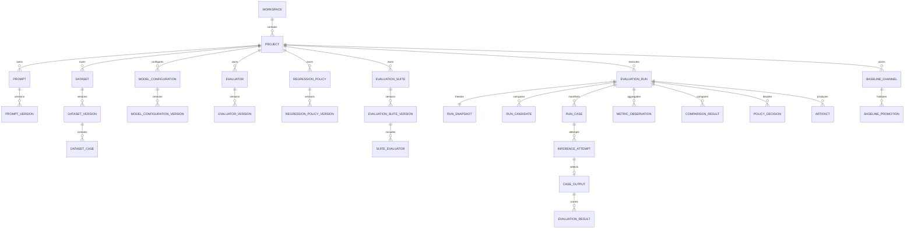

# Database Schema Proposal

## 1. Objectives

The database must preserve immutable evaluation evidence, support transactional orchestration, prevent cross-project leakage, and answer historical comparison queries without storing large model payloads in hot relational rows.

Recommended persistence:

- **PostgreSQL:** authoritative metadata, immutable versions, execution state, selected evidence, aggregates, policy decisions, audit, idempotency, and outbox.
- **S3-compatible object storage:** large prompt/output bodies, raw provider payloads when retention permits, and HTML/JSON reports.
- **Redis:** queue transport, rate limiting, short-lived cache, and leased coordination. Redis is never authoritative for run state.

This proposal uses UUID/opaque identifiers, `timestamptz` in UTC, `jsonb` only for type-specific or infrequently queried structures, `numeric` for currency, and `bigint` for tokens/durations where appropriate.

## 2. Modeling conventions

- Every tenant-owned row carries `workspace_id`; most also carry `project_id` to make authorization and partitioning explicit.
- Mutable roots use `revision bigint` for optimistic concurrency and `updated_at`.
- Published definitions are immutable. Corrections produce a new version.
- Version tables contain monotonic `version_number` per parent and a canonical `content_hash`.
- Deletion is usually archival (`archived_at`). Referenced immutable evidence cannot be hard-deleted outside an approved retention workflow.
- Large evidence is represented by an `object_blob` reference. Hashes are calculated over canonical uncompressed bytes.
- Status fields use database constraints or controlled lookup values; application enums alone are insufficient.
- Money uses a fixed currency and `numeric(20,10)` initial precision; never floating point.
- User metadata is bounded and kept separate from authoritative fields.

## 3. Relationship overview

## 4. Identity, tenancy, and access

### `workspace`

| Column | Type | Constraints/notes |
|---|---|---|
| `id` | uuid | PK |
| `slug` | text | unique, normalized |
| `name` | text | required |
| `status` | text | active/suspended/archived |
| `created_at`, `updated_at` | timestamptz | required |

### `project`

| Column | Type | Constraints/notes |
|---|---|---|
| `id` | uuid | PK |
| `workspace_id` | uuid | FK workspace, required |
| `slug`, `name`, `description` | text | unique `(workspace_id, slug)` |
| `default_timezone` | text | display only; storage remains UTC |
| `data_classification` | text | public/internal/confidential/restricted |
| `status`, `revision` | text, bigint | optimistic concurrency |
| `created_at`, `updated_at`, `archived_at` | timestamptz | |

### `principal`, `workspace_membership`, `service_token`

- `principal`: user or service identity, external subject, display name, status.
- `workspace_membership`: `(workspace_id, principal_id)`, role, optional project restrictions.
- `service_token`: ID, project/workspace scope, hash of token (never plaintext), permissions, expiry, last-used timestamp, revoked timestamp.

For initial deployment, roles are viewer, runner, editor, approver, and admin. Fine-grained permissions may later replace fixed roles.

## 5. Authoring and immutable versions

### `prompt` and `prompt_version`

`prompt` is mutable identity metadata. `prompt_version` contains:

| Column | Type | Constraints/notes |
|---|---|---|
| `id`, `prompt_id`, `workspace_id`, `project_id` | uuid | PK and scoped FKs |
| `version_number` | bigint | unique `(prompt_id, version_number)` |
| `content_type` | text | text/chat |
| `template_definition` | jsonb | bounded canonical prompt/messages representation |
| `variable_schema` | jsonb | approved JSON Schema subset |
| `rendering_engine_version` | text | required |
| `content_hash` | text | unique within prompt where appropriate |
| `changelog`, `source_commit_sha` | text | provenance |
| `created_by`, `created_at` | uuid, timestamptz | immutable |

No `updated_at` exists on published version rows.

### `dataset`, `dataset_draft`, `dataset_version`, `dataset_case`

- `dataset`: stable identity and archive state.
- `dataset_draft`: mutable revision, schema, description, classification, editor, validation summary.
- `dataset_draft_case`: draft-only rows keyed by `(dataset_draft_id, case_key)`.
- `dataset_version`: immutable version number, schema, content hash, case count, release notes, publisher and time.
- `dataset_case`: immutable case membership and content.

`dataset_case` columns:

| Column | Type | Constraints/notes |
|---|---|---|
| `id` | uuid | PK |
| `dataset_version_id` | uuid | FK, required |
| `case_key` | text | unique per version, stable logical identity |
| `ordinal` | integer | deterministic report order, unique per version |
| `input_data` | jsonb or blob ref | exactly one storage representation |
| `expected_data` | jsonb or blob ref | optional |
| `assertions` | jsonb | bounded evaluator-specific declarations |
| `tags` | text[] | GIN-indexed if query volume warrants |
| `criticality` | text | normal/critical |
| `metadata` | jsonb | bounded, non-authoritative |
| `content_hash` | text | required |

For large cases, `input_data`/`expected_data` become small manifests pointing to `object_blob`. The publishing transaction copies validated draft content into version rows and calculates a manifest hash over ordered case key/hash pairs.

### `model_configuration` and `model_configuration_version`

Version fields include adapter type, provider model ID, normalized generation parameters, routing policy, timeout, retry policy, expected response format, maximum tokens, pricing snapshot/reference, and `secret_reference_id`. Secret values never enter PostgreSQL unless an encrypted secret-store adapter is explicitly approved.

A uniqueness constraint on content hash can prevent accidental duplicate versions while still preserving logical identities.

### `evaluator`, `evaluator_version`

Fields include evaluator type, configuration, metric declarations, score range/direction, rubric/prompt reference, judge model configuration version, implementation identifier/version, semantic hash, creator, and timestamp. A model judge’s prompt, rubric, model, and parser versions are all part of semantic identity.

### `regression_policy`, `regression_policy_version`, `policy_rule`

Policy identity and immutable versions are separate. Normalize rules because they are query-critical and need referential checks.

`policy_rule` fields:

- `policy_version_id`, stable `rule_key`, ordinal.
- type, severity (warning/blocking), metric semantic identity.
- scope type and selector (whole run, candidate, evaluator, tag/slice, case).
- comparator, threshold value/unit, delta mode, missing-evidence behavior.
- minimum sample/coverage and bounded parameters.

Unique `(policy_version_id, rule_key)`.

### `evaluation_suite`, `evaluation_suite_version`

Version fields include dataset version, policy version, execution defaults, budget defaults, and compatibility mode. Join tables:

- `suite_evaluator`: evaluator version, required flag, weight, ordinal.
- `suite_model_slot`: optional permitted/default model configuration versions or model constraints.

Prompt/model candidates may be selected at run submission if suite policy allows; all are resolved in the run snapshot.

## 6. Runs and orchestration

### `evaluation_run`

| Column | Type | Constraints/notes |
|---|---|---|
| `id`, `workspace_id`, `project_id` | uuid | PK/scoping |
| `suite_version_id` | uuid | published version |
| `state` | text | execution state constraint |
| `gate_outcome` | text | not_evaluated/pass/fail/error |
| `priority` | smallint | bounded |
| `snapshot_hash` | text | required once validated |
| `source_context` | jsonb | repository/ref/SHA/PR/actor, indexed selectively |
| `idempotency_record_id` | uuid | optional FK |
| `baseline_run_id` | uuid | resolved immutable baseline, nullable |
| `baseline_channel`, `baseline_revision` | text, bigint | resolution provenance |
| `created_by` | uuid | principal |
| `created_at`, `queued_at`, `started_at`, `finished_at` | timestamptz | phase timing |
| `cancel_requested_at`, `cancelled_at` | timestamptz | cooperative cancellation |
| `deadline_at` | timestamptz | bounded run lifetime |
| `failure_code`, `failure_detail_safe` | text | no raw secrets |
| `state_revision` | bigint | compare-and-set transitions |

Indexes: project/time descending, project/state, project/gate/time, source commit, suite/time, and partial indexes for nonterminal states.

### `run_snapshot`

One-to-one with run. Stores canonical, immutable resolved configuration needed to reconstruct the run:

- Schema/planner version.
- Resource version IDs and hashes.
- Candidate aliases and configs.
- Case manifest hash.
- Baseline resolution.
- Evaluator/policy semantics.
- Execution limits and budget reservation.
- Source context and allowed metadata.

The canonical JSON may be stored inline initially and moved to an object blob if large. A relational manifest still exposes all referenced IDs for integrity and queryability. No secret values are included.

### `run_candidate`

One row per candidate alias: run, prompt version, model configuration version, display label, ordinal, resolved provider model metadata, and status summary. Unique `(run_id, alias)` and `(run_id, ordinal)`.

### `run_case`

Materialized work manifest with run, dataset case, stable case key/hash, ordinal, slice/tag projection, and status. Unique `(run_id, dataset_case_id)` and `(run_id, case_key)`.

### `work_item` and `work_attempt`

`work_item` is the durable logical unit:

- Run ID, type, logical key, candidate/case/evaluator refs as applicable.
- State, priority, available time, lease owner/expiry, attempt count, max attempts.
- Dependency counter or explicit dependency edges.
- Error classification and timestamps.

Unique `(run_id, work_type, logical_key)` prevents duplicate logical work.

`work_attempt` records each lease/execution attempt: attempt number, worker ID, start/end, heartbeat, status, safe error, trace ID, and optional provider attempt. Unique `(work_item_id, attempt_number)`.

A `work_dependency` table may model fan-in explicitly. For MVP, planner-created counters plus reconciler checks can be simpler, but correctness must not rely solely on queue ordering.

## 7. Provider calls and evaluation evidence

### `inference_attempt`

Every external model request is an attempt, including failed and ambiguous calls.

Fields:

- Scope IDs: workspace, project, run, candidate, run case, work attempt.
- Provider adapter and model requested/resolved.
- Request hash and optional encrypted/request blob ref.
- Provider request ID, client attempt ID.
- Status and normalized error category/code/retryable flag.
- Started/finished timestamps, latency milliseconds.
- Input/output/total tokens and provider-specific usage JSON.
- Estimated and reported cost with currency and cost-source indicator.
- Response blob ref and response hash when received.
- Finish reason and content-policy flags.

Indexes support run/candidate/case lookup, provider operational analysis, and time-based retention. Partition monthly by `created_at` when volume justifies it.

### `case_output`

Represents the selected successful or terminal result for a logical run candidate/case:

- Run, candidate, case, selected inference attempt.
- Output text/structured object inline under threshold or blob ref.
- Output hash, finish reason, status.
- Rendered input hash and optional rendered input blob.
- Selection reason and selector engine version.

Unique `(run_id, run_candidate_id, run_case_id)` guarantees one selected output while preserving all attempts.

### `evaluation_result`

One selected evaluator result per output/evaluator semantic identity:

- Run/candidate/case/output/evaluator version IDs.
- Status: passed/failed/scored/errored/skipped/not_applicable.
- Numeric score and unit or categorical label.
- Explanation and bounded evidence JSON/blob.
- Implementation version, semantic hash.
- Judge inference attempt ID where applicable.
- Error category, start/end, latency.

Unique `(case_output_id, evaluator_version_id, semantic_hash)`.

### `metric_observation`

Derived aggregate rows:

- Run, candidate, evaluator/metric identity.
- Scope type/key (whole dataset or canonical slice).
- Numeric value, unit, direction.
- Counts: total, valid, errors, skipped.
- Aggregation method and engine version.
- Optional distribution summary JSON containing bounded percentile values.

Unique on run/candidate/metric/scope/aggregation version. Store derivation time and input manifest hash so stale aggregates are detectable.

## 8. Comparison and gate evidence

### `comparison_result`

Stores aggregate comparisons between candidate and baseline:

- Candidate run/candidate and baseline run/candidate.
- Metric semantic identity and scope.
- Candidate/baseline observation IDs.
- Absolute delta, relative delta, direction, classification.
- Compatibility status/reason.
- Comparator engine version and input hash.

### `case_comparison`

Case-level paired evidence:

- Comparison ID, stable case key.
- Candidate and baseline case output/evaluation refs.
- Classification, scores/delta, compatibility/missing reason.
- Diff summary and optional detailed diff artifact ref.

Unique `(comparison_id, case_key, evaluator_semantic_hash)`.

### `gate_decision` and `policy_decision`

`gate_decision` is one final decision per run and policy engine version, containing outcome, policy version, evidence hash, coverage summary, engine version, and decision timestamp.

`policy_decision` contains one row per evaluated rule: status, observed value/unit, threshold, scope, severity, explanation, affected count, and bounded sample case keys. Full affected cases can use a join table or report artifact.

Unique `(gate_decision_id, rule_key)`.

## 9. Baselines

### `baseline_channel`

| Column | Type | Constraints/notes |
|---|---|---|
| `id`, `workspace_id`, `project_id` | uuid | scoped identity |
| `name` | text | unique per project |
| `run_id` | uuid | current eligible run, nullable until initialized |
| `run_candidate_id` | uuid | selected candidate where run has many |
| `revision` | bigint | increment every promotion |
| `updated_by`, `updated_at` | uuid, timestamptz | |

### `baseline_promotion`

Append-only history: channel, from/to run and candidate, from/to revisions, actor, reason, request/source context, and timestamp. Unique `(baseline_channel_id, to_revision)`. Rollback creates another promotion.

Eligibility constraint is enforced transactionally by domain logic: same project, completed run, pass outcome unless an approved override role/reason is used, compatible suite family, and finalized evidence. A database trigger may provide defense in depth but should not embed evolving policy semantics.

## 10. Artifacts and object blobs

### `object_blob`

Metadata for external bytes: workspace/project, storage backend, opaque key, SHA-256, size, content type/encoding, encryption key ref, classification, retention class, created time, expiry, and deletion tombstone. Unique storage key; optionally unique scoped hash for deduplication.

### `artifact`

Links a run to report/evidence artifact:

- Kind (`html_report`, `json_summary`, `json_results`, `diff`, `log_export`).
- Blob ID, schema version, renderer version.
- Publication state, generated timestamp, supersedes artifact ID.
- Hash and size copied for fast listing.

Artifacts are immutable. Regeneration creates a new row and may supersede the old renderer output without changing original evidence.

## 11. Integrations, events, and audit

### `integration`, `webhook_subscription`

Integration rows contain project scope, type, non-secret configuration, secret reference, enabled status, event filters, and revision. Webhook subscriptions additionally contain endpoint URL, signing-secret reference, delivery policy, and disable-on-failure controls. Endpoint URL validation and SSRF prevention are application responsibilities.

### `outbox_event`

Transactional event record: ID, aggregate type/ID, sequence, event type, schema version, payload (bounded and redacted), occurred time, available time, dispatched time, and correlation ID. Unique `(aggregate_type, aggregate_id, sequence)`.

### `delivery_attempt`

Outbox event/integration, attempt number, status, HTTP/provider status, safe response excerpt, next attempt, timestamps, and deduplication key. Unique `(outbox_event_id, integration_id, attempt_number)`.

### `audit_event`

Append-only: workspace/project, actor principal/service, action, target type/ID, request/correlation IDs, source IP hash or controlled value, non-secret before/after summary, reason, and timestamp. Partition by time at scale. Application roles cannot update/delete audit rows.

### `idempotency_record`

Scope (workspace/project/principal), endpoint/operation, key hash, request hash, response resource/status, state, created/expiry times. Unique `(scope, operation, key_hash)`. A reused key with a different request hash returns conflict.

## 12. Budget and usage

### `budget_policy`, `budget_reservation`, `usage_ledger`

- `budget_policy`: project/global period, currency, soft/hard limit, per-run cap, token cap, and revision.
- `budget_reservation`: run, estimated amount/tokens, state, expiry, actual reconciled amount.
- `usage_ledger`: append-only provider/judge usage entries tied to inference attempts, cost source, amount/currency, token dimensions, and occurrence time.

A transaction reserves estimated budget before queueing. Calls re-check remaining run limits. Final reconciliation records estimate-versus-actual differences; unknown provider cost is visible rather than treated as zero.

## 13. Key invariants

1. A run references only published immutable versions.
2. Run snapshot hash cannot change after validation.
3. Secret values never appear in snapshots, outbox events, audit summaries, or artifacts.
4. One logical case output is selected per run/candidate/case; all attempts remain append-only.
5. A completed gate decision references finalized aggregate/comparison evidence hashes.
6. Gate pass is impossible when required policy decisions are violated, errored, or insufficient.
7. Baseline history is append-only and channel revision increments exactly once per promotion.
8. Cross-project references are rejected even if UUIDs exist.
9. Terminal run states do not transition.
10. Report artifacts cannot overwrite prior bytes or rows.
11. Queue loss cannot lose authoritative work because pending `work_item`/outbox rows remain.
12. Raw payload deletion leaves aggregate/audit provenance and a deletion tombstone where policy allows.

## 14. Indexing and query plan

Initial indexes:

- Every FK and tenant scope prefix.
- `evaluation_run(project_id, created_at desc)` and partial `(project_id, state, created_at)` for nonterminal runs.
- `evaluation_run(project_id, gate_outcome, created_at desc)`.
- Expression/indexed source commit SHA if frequently filtered.
- `run_case(run_id, ordinal)` and `(run_id, case_key)`.
- `inference_attempt(run_id, run_candidate_id, run_case_id, created_at)`.
- `evaluation_result(run_id, evaluator_version_id, status)`.
- `metric_observation(run_id, run_candidate_id, metric_identity, scope_type, scope_key)`.
- `case_comparison(comparison_id, classification)`.
- `work_item(state, available_at, priority)` partial for runnable work; `(lease_expires_at)` for leased work.
- `outbox_event(available_at)` partial where undispatched.
- `delivery_attempt(next_attempt_at)` partial for pending delivery.
- GIN on tags/limited JSON only after measured query need.

Avoid broad GIN indexes on large arbitrary metadata. History APIs use cursor pagination based on `(created_at, id)`.

## 15. Partitioning and retention

Do not partition small tables prematurely. Define migration-ready candidates:

- `inference_attempt`, `usage_ledger`, `audit_event`, `delivery_attempt`: monthly range partitions.
- `case_output`, `evaluation_result`, and `case_comparison`: partition by run creation month once tens of millions of rows make maintenance problematic.

Retention classes:

- Immutable definitions and aggregate gate evidence: long-lived until project deletion policy.
- Raw request/response blobs: configurable, e.g. 30–90 days.
- HTML/JSON reports: configurable, e.g. 1 year or release-history duration.
- Operational delivery/debug details: shorter, e.g. 30 days.
- Audit: compliance-defined, typically longer and append-only.

A retention job first marks expiry, then deletes object bytes idempotently, records deletion, and finally prunes eligible relational payload references. Legal hold overrides expiry.

## 16. Migration, backup, and recovery

- Forward-only versioned migrations; expand/migrate/contract for zero-downtime changes.
- No destructive migration without backup, measured row impact, and explicit approval.
- Database point-in-time recovery and object versioning are production requirements.
- Restore drills must verify that DB manifests and object hashes reconcile.
- New enum semantics should prefer constrained text or lookup tables to avoid blocking enum migrations.
- Backfills are resumable, rate-limited, observable, and version-stamped.

Target recovery objectives need business approval. Initial proposal: RPO <= 15 minutes and RTO <= 4 hours for metadata; immutable artifact replication may have a separate objective.

## 17. Data access and privacy

- Repositories enforce workspace/project predicates centrally; optional PostgreSQL row-level security is a later defense-in-depth layer after connection-pool implications are tested.
- Raw restricted outputs require a separate permission and access audit event.
- List/report summary queries return redacted excerpts, not full payloads.
- Encrypted object storage uses per-environment keys initially; per-workspace keys are a future enterprise capability.
- Project deletion is asynchronous and produces a signed deletion manifest/tombstones while retaining only legally required audit facts.

## 18. Open schema decisions

1. Maximum inline payload threshold before object storage.
2. Whether dataset cases require globally stable identities across datasets, or stable keys within a dataset lineage are sufficient.
3. Whether multi-turn/agent traces need normalized message/tool tables in v1.
4. Required hard-delete and legal-hold semantics.
5. Initial RPO/RTO and cross-region replication requirements.
6. Whether pricing is a versioned platform catalog or only captured from provider responses.
7. Whether PostgreSQL RLS is required at launch.
8. Which task queue is selected and whether `work_item` claiming is queue-driven or PostgreSQL-driven.
