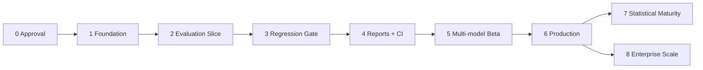

# Implementation Roadmap

## 1. Roadmap strategy

Delivery is evidence-driven rather than date-driven. Each phase ends in a reviewable vertical capability and cannot advance until its acceptance gate passes. Calendar estimates assume a focused team of four to six engineers plus part-time product/security/SRE support; they are planning ranges, not commitments.

No implementation begins before Phase 0 approval.

## 2. Phase summary

| Phase | Outcome | Indicative duration | Exit artifact |
|---|---|---:|---|
| 0. Architecture approval | Scope, semantics, risks, and decisions approved | 1–2 weeks | Signed PRD/architecture/ADRs/test strategy |
| 1. Foundation and authoring | Secure, reproducible control plane with immutable definitions | 2–3 weeks | Versioned prompt/dataset/suite APIs |
| 2. Evaluation vertical slice | One OpenRouter candidate runs asynchronously and is scored | 3–4 weeks | Durable run with raw and metric evidence |
| 3. Regression gate | Baseline comparison and deterministic policy decision | 3–4 weeks | Pass/fail/error gate with promotion history |
| 4. Reports and developer workflow | HTML/JSON history, GitHub Actions, Slack | 2–3 weeks | End-to-end PR quality gate |
| 5. Multi-model production beta | Concurrent candidates, LLM judge, budgets, operational beta | 3–4 weeks | Team beta under real workloads |
| 6. Production readiness | Security, scale, recovery, SLOs, release controls | 2–4 weeks | Production launch approval |
| 7+. Scale and intelligence | Statistical, provider, human, drift, enterprise features | Iterative | Capability releases |

Parallel work is allowed inside a phase only where dependencies and ownership are clear. Acceptance is cumulative.

## 3. Phase 0 — Architecture and product approval

### Scope

- Review the five planning artifacts with product, AI, backend, SRE, and security stakeholders.
- Resolve all P0 open questions.
- Choose queue/workflow implementation after a targeted failure-mode spike.
- Record architecture decisions and a threat model.
- Define representative golden fixtures, labeled regressions, and a test traceability matrix.
- Establish cost/concurrency/retention/RPO/RTO targets.

### Deliverables

- Approved PRD, architecture, database proposal, tasks, and roadmap.
- ADR set for immutable snapshots, baseline channels, orchestration source of truth, provider/evaluator interfaces, queue selection, artifacts, and tenancy.
- API/report/event schema governance policy.
- Initial threat model and data-flow classification.
- Test strategy with fake provider and fault-injection design.

### Acceptance criteria

1. Product owner approves MVP, non-goals, personas, and success metrics.
2. Staff engineering approves component boundaries, state machines, consistency strategy, and scale path.
3. Security approves initial trust boundaries, secret handling, permitted OpenRouter data classes, and threat-model mitigations.
4. SRE approves initial SLOs, capacity target, RPO/RTO, and deployment topology.
5. Every open P0 question has a decision, owner, or explicit later-phase deferral.
6. Quality `fail`, system `error`, cancellation, and missing baseline semantics are unambiguous.
7. An implementation authorization is recorded. Until then, no source files are created.

## 4. Phase 1 — Foundation and versioned authoring

### Scope

- Establish pinned toolchain, quality checks, typed configuration, secret interface, observability, containers, PostgreSQL migrations, Redis, and object storage.
- Implement project-scoped authentication/authorization and audit foundation.
- Deliver immutable prompt versions, dataset draft/publish lifecycle, model config versions, evaluator/policy definitions, and suite versions.

### Key decisions locked in this phase

- Canonical serialization and content-hashing rules.
- Inline-versus-object payload threshold.
- Initial auth/token approach and tenant-scoping enforcement.
- Exact JSONL dataset contract.

### Acceptance criteria

1. A clean Linux environment can start the documented container topology using pinned artifacts and pass readiness checks.
2. The schema upgrades from zero and a tested rollback/restore path exists for the phase’s migrations.
3. Service-token authentication and role checks pass positive and negative tests; cross-project identifier substitution is denied across all implemented resources.
4. A prompt can be published only when its variable contract is valid; published versions cannot be mutated.
5. A dataset draft can be validated and published atomically; duplicate keys, incompatible inputs, malformed assertions, and excessive payloads receive actionable errors.
6. Equivalent canonical content produces identical hashes; a one-byte semantic change produces a different hash.
7. Suites reject unpublished or cross-project refs and preserve all historical versions.
8. Seeded secret canaries never appear in logs, API reads, audit summaries, or stored snapshots.
9. Unit/integration/migration tests and required lint/type/security checks pass in CI.

## 5. Phase 2 — Reliable evaluation vertical slice

### Scope

- Implement provider-neutral contracts and OpenRouter adapter.
- Implement run submission, idempotent immutable snapshot, transactional outbox, durable work manifests, worker leases, retries, cancellation, and reconciliation.
- Execute one candidate model across a published dataset.
- Add deterministic evaluators and usage/cost evidence.

### Demonstration

A user publishes a prompt and ten-case dataset, submits a run, observes asynchronous progress, and retrieves per-case outputs, deterministic scores, errors, latency, tokens, and cost.

### Acceptance criteria

1. A run snapshot pins exact prompt, dataset, model config, evaluator, policy placeholder, source revision, limits, and hashes, without secret values.
2. Same idempotency key and payload returns the original run; a different payload with the same key returns conflict.
3. Every planned case has exactly one selected terminal result while all provider attempts remain auditable.
4. OpenRouter success, malformed response, timeout, 429, transient 5xx, authentication error, unsupported model, and content-policy responses map to documented normalized outcomes.
5. Retryable errors use bounded backoff/jitter; permanent errors are not retried.
6. Killing a worker before a call, during a call, after response, and after persistence does not lose the run or select duplicate evidence; possible duplicate spend is recorded.
7. Queue outage after run commit leaves recoverable pending work; database outage prevents untracked provider calls.
8. Cancellation stops new work, handles late responses safely, and preserves partial evidence.
9. Token/cost totals reconcile to selected and duplicate attempts; unavailable cost is marked unknown, never zero.
10. At least 1,000 fake-provider case executions complete under fault injection with exact manifest accounting.

## 6. Phase 3 — Baselines and regression gate

### Scope

- Add baseline channels and promotion history.
- Aggregate metrics by candidate, evaluator, and slices.
- Pair candidate/baseline cases by stable identity.
- Add comparison classifications and deterministic policy engine.
- Expose machine-readable gate decisions and rule evidence.

### Demonstration

Promote a passing run to `main`; run a changed prompt; detect a critical case regression; block the candidate with the exact rule and affected case; then run an improvement and pass.

### Acceptance criteria

1. Baseline resolution is frozen at submission with channel revision and target run/candidate.
2. Promotion requires an eligible run, approver, reason, and expected revision; two concurrent promotions produce exactly one winner and one conflict.
3. Rollback is represented as a new promotion, preserving complete history.
4. Pairing is by stable case and evaluator semantic identity; reordered datasets compare correctly.
5. Missing, added, changed, and incompatible cases are counted and governed explicitly.
6. Higher-is-better, lower-is-better, absolute, percentage, slice, critical-case, coverage, and error-rate rules pass boundary/property tests.
7. Improvements cannot offset critical regressions unless the versioned policy explicitly allows it.
8. Replaying persisted evidence and the same policy/engine version produces a byte-equivalent ordered decision model.
9. Required missing evidence, evaluator failure, or incompatible baseline cannot result in pass.
10. Gate `fail` and gate `error` are distinguishable in API responses and audit history.

## 7. Phase 4 — Reports and CI/CD workflow

### Scope

- Generate versioned JSON summaries/results and safe self-contained HTML diff reports.
- Add artifact publication and historical run/report APIs.
- Deliver a CI client/reusable GitHub Actions workflow.
- Add Slack and signed webhook delivery through the outbox.

### Demonstration

A pull request workflow submits a candidate, reports progress, posts summary/artifacts, and blocks merge. Slack links to an HTML report showing the blocking rule and side-by-side changed output.

### Acceptance criteria

1. HTML includes provenance, configuration, baseline, rule decisions, aggregate/slice metrics, cost/latency, errors, regressions, improvements, and case-level diffs.
2. A malicious output corpus containing scripts, event handlers, hostile links, Markdown/HTML, and oversized text executes no active content; CSP and encoding tests pass.
3. JSON artifacts validate against published schemas and compatibility fixtures.
4. Artifact writes are atomic and hash-verified; interrupted writes are neither listed nor downloadable as complete.
5. Authorized users can query/paginate history and retrieve signed artifacts; unauthorized and cross-project access fail.
6. The CI client has distinct outcomes for pass, quality fail, system error/timeout, invalid request, and client failure.
7. A quality-regression fixture fails CI for the documented rule; a provider-outage fixture blocks CI as system error rather than regression.
8. Client timeout leaves the server run active unless cancellation was explicitly requested.
9. Slack delivery is redacted, deduplicated, retryable, and does not alter gate outcome when Slack is unavailable.
10. Webhook signatures, replay windows, event IDs, retries, and consumer deduplication are verified.

## 8. Phase 5 — Multi-model production beta

### Scope

- Execute multiple candidate models with controlled concurrency and priorities.
- Add calibrated rubric-based LLM judge.
- Enforce provider/project/model budgets and rate limits.
- Add dashboards, beta feedback, policy tuning, and runbook drafts.
- Validate real GitHub workflows with selected internal teams.

### Demonstration

A suite compares at least three candidate model configurations against one baseline, applies deterministic and judge metrics, remains within a hard budget, and produces one explainable gate.

### Acceptance criteria

1. Candidate × case × evaluator accounting remains exact for at least three models and representative dataset sizes.
2. Per-provider/model/project limits prevent one run or project from starving all work; CI priority behavior is documented and tested.
3. Hard budgets prevent calls beyond cap; estimates, reservations, actuals, unknowns, and duplicate spend reconcile.
4. Judge prompt, rubric, model, parser, and score semantics are pinned and visible.
5. Candidate outputs are treated as untrusted judge input; adversarial prompt-injection fixtures cannot alter judge instructions or invoke tools.
6. Judge calibration reaches stakeholder-approved agreement on a labeled fixture set; unresolved disagreement is documented and judge rules can be warning-only.
7. Provider alias/revision drift is visible and strict policy can reject an incompatible comparison.
8. Beta teams complete agreed runs with no cross-project leakage or unbounded spend.
9. False-positive, false-negative, flaky-case, runtime, cost, and developer-friction feedback is captured against success indicators.
10. Operational dashboards identify queue delay, stuck runs, provider errors, gate outcomes, cost, and notification failures.

## 9. Phase 6 — Production readiness and launch

### Scope

- Complete security, privacy, performance, soak, disaster-recovery, operational, and release reviews.
- Finalize SLOs, alerts, runbooks, backup/restore, retention, and compatibility policies.
- Harden images and deployment process.

### Acceptance criteria

1. Threat model covers API/IDOR, token lifecycle, provider egress, SSRF, report injection, judge injection, webhook replay, queue poisoning, secret leakage, and denial-of-wallet.
2. No open critical/high security finding remains; lower risks have owners and explicit acceptance or deadlines.
3. Load test sustains the approved target (initial proposal: 100 concurrent provider calls and 100k case-results/day) without invariant violation; queue age and API latency remain within approved SLOs.
4. A soak test validates leases, retries, reconciliation, and resource stability through dependency disruptions.
5. PostgreSQL PITR and object backup/versioning are enabled; a restore drill meets approved RPO/RTO and reconciles artifact hashes.
6. Retention deletion, legal hold, restricted evidence access, provider allowlists, and audit immutability are verified.
7. Alerts and runbooks are exercised for provider, queue, database, object store, stuck run, budget anomaly, token compromise, and failed migration scenarios.
8. Containers run non-root, direct dependencies/images are pinned and scanned, SBOM is generated, and release artifacts are signed where the platform supports it.
9. API, event, and report compatibility/deprecation policies are published.
10. Product, engineering, security, and SRE sign the launch checklist; a rollback/degraded-mode plan is approved.

## 10. Phase 7 — Statistical confidence and evaluator maturity

### Candidate capabilities

- Repeated sampling and configurable seeds where providers support them.
- Confidence intervals and paired significance testing.
- Flaky-case detection and quarantine with visible coverage impact.
- Human review and judge calibration workflows.
- Semantic and domain-specific evaluators.

### Acceptance criteria

- Statistical methods have documented assumptions and minimum sample requirements.
- Policies never label non-significant changes as statistically proven regressions.
- Repeated sampling exposes added cost before execution and obeys hard budgets.
- Human evaluation preserves blinding, assignment, adjudication, and audit.

## 11. Phase 8 — Provider and enterprise scale

### Candidate capabilities

- Native provider adapters, routing/fallback, and regional provider constraints.
- Scheduled production-drift evaluation from privacy-reviewed samples.
- SSO/SCIM, fine-grained roles, tenant encryption keys, residency, and legal hold.
- Partitions/read replicas, analytics stream, autoscaling, and selective service extraction.

### Acceptance criteria

- Every provider passes the same contract and fault suite.
- Fallback provenance makes comparisons compatible only when policy allows.
- Regional and tenant controls fail closed.
- Service extraction is justified by measured load/security/SLO evidence, not forecast complexity.

## 12. Dependency and sequencing notes

- Safe report design can start during Phase 3 after comparison schemas stabilize.
- CI client contract can be designed during Phase 2 but must not freeze exit semantics before Phase 3.
- Security reviews run continuously; Phase 6 is verification, not the first security activity.
- Load fixtures and observability begin in Phase 1 and mature incrementally.
- A dashboard should not delay the API/CLI quality gate unless Phase 0 changes MVP scope.

## 13. Rollout model

1. **Local/dev:** Fake provider and explicitly opt-in OpenRouter project; synthetic/non-sensitive datasets.
2. **Internal alpha:** One team, warning-only gates, strict cost cap, manual baseline promotion.
3. **Internal beta:** Multiple teams, selected blocking policies, protected baseline channel, on-call coverage.
4. **Production limited availability:** Approved data classes and workloads, SLOs active, launch checklist complete.
5. **General availability:** Only after policy false-positive/negative rates, capacity, support, and compliance needs are understood.

A warning-only period is recommended for every new suite/policy. Promotion to blocking requires enough labeled outcomes and explicit owner approval.

## 14. Go/no-go indicators

### Go

- Teams can explain every gate from persisted evidence.
- Regression fixtures are detected consistently without conflating provider failures.
- Cost and queue behavior stay bounded under target load.
- CI integration has acceptable time-to-feedback and clear remediation paths.
- Security/recovery exercises pass.

### No-go

- A missing or errored case can be silently excluded from a passing gate.
- Baseline target can change during a run.
- Model output can execute in a report.
- A worker crash can lose authoritative work or corrupt selected evidence.
- Cross-project access or secret leakage is observed.
- Provider spend can exceed hard cap without explicit, audited override.

## 15. Future scalability concerns to monitor

| Signal | Likely response |
|---|---|
| Queue age grows while provider quota is available | Scale workers or separate provider/priority pools |
| PostgreSQL write/maintenance pressure from attempts | Partition high-volume tables; batch writes carefully |
| History reads affect orchestration writes | Read replicas/materialized analytics projections |
| Reports become very large | Split index/detail artifacts; lazy authorized retrieval |
| Provider limits dominate runtime | Quota-aware scheduler, batch APIs, regional/provider routing |
| Evaluator workloads differ from inference | Dedicated evaluator pools or remote evaluator protocol |
| Tenant security requirements diverge | RLS validation, dedicated deployments, tenant keys/regions |
| Independent component SLOs are required | Extract execution/report/integration service selectively |
| Nondeterministic gates remain noisy | Repeated sampling, confidence methods, flaky-case governance |
| Dataset growth reduces feedback speed | Tiered suites: PR smoke, merge regression, nightly exhaustive |

## 16. Review cadence

- Architecture decisions: review whenever an invariant, trust boundary, or service boundary changes.
- Policies/datasets: owners review after labeled production misses, provider revisions, or scheduled quarterly cadence.
- SLO/capacity/cost: monthly during beta, quarterly after stabilization.
- Threat model and disaster recovery: before launch and at least annually or after major architecture change.
- Roadmap: re-rank after each phase based on measured evidence, not feature count.
